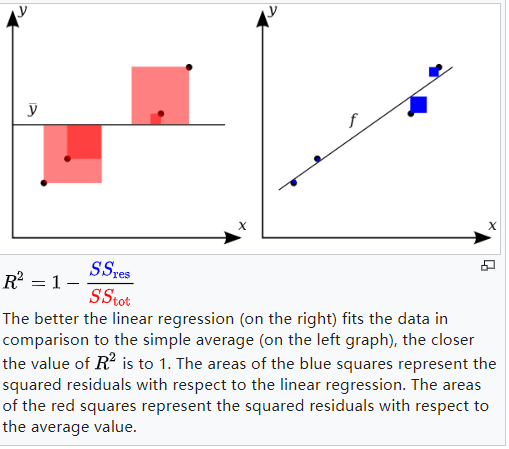

# 天池竞赛之二手车交易价格预测大赛
Datawhale&天池------数据挖掘之二手车交易价格预测大赛

大赛地址：https://tianchi.aliyun.com/competition/entrance/231784/introduction?spm=5176.12281949.1003.2.19032448rNzs9P

以下记录学习过程（部分内容引用自蜗牛车）：

## 1.1评价指标

+ 本赛题的评价标准为MAE(Mean Absolute Error):

$$
M A E=\frac{\sum_{i=1}^{n}\left|y_{i}-\hat{y}_{i}\right|}{n}
$$

+ 分类算法常见的评估指标如下：
  + 对于二类分类器/分类算法，评价指标主要有accuracy， [Precision，Recall，F-score，Pr曲线]，ROC-AUC曲线。
  + 对于多类分类器/分类算法，评价指标主要有accuracy， [宏平均和微平均，F-score]。

+ 对于回归预测类常见的评估指标如下:
  + 平均绝对误差（Mean Absolute Error，MAE），均方误差（Mean Squared Error，MSE），平均绝对百分误差（Mean Absolute Percentage Error，MAPE），均方根误差（Root Mean Squared Error）， R2（R-Square）

    **均方误差（Mean Squared Error，MSE）**,其计算公式为：
    $$
    M S E=\frac{1}{N} \sum_{i=1}^{N}\left(y_{i}-\hat{y}_{i}\right)^{2}
    $$
    **$R^2$（R-Square）的公式为**： 
    
    + 回归平方和：
    
    $$
    S S_{\mathrm{reg}}=\sum_{i}\left(\hat{y}_{i}-\bar{y}\right)^{2}
    $$
    
    + 残差平方和：
    
    $$
    S S_{r e s}=\sum\left(y_{i}-\hat{y}_{i}\right)^{2}
    $$
    
    + 总离差平方和:
    
    $$
    S S_{t o t}=\sum\left(y_{i}-\bar{y_{i}}\right)^{2}
    $$
    
    ​       其中$\bar{y_{i}}$表示$y$的平均值 得到$R^2$表达式为：
    $$
    R^{2} \equiv \frac{S S_{\mathrm{reg}}}{S S_{\mathrm{tot}}}
    $$
    
    ​        同时
    $$
    R^{2}=1-\frac{S S_{r e s}}{S S_{t o t}}=1-\frac{\sum\left(y_{i}-\hat{y}_{i}\right)^{2}}{\sum\left(y_{i}-\bar{y_{i}}\right)^{2}}
    $$
    ​        详细说明如下图
    
    
    
    ${R^2}$用于度量因变量的变异中可由自变量解释部分所占的比例，取值范围是 0~1，${R^2}$越接近1,表明回归平方和占总平方和的比例越大,回归线与各观测点越接近，用x的变化来解释y值变化的部分就越多,回归的拟合程度就越好。

## 1.2分析赛题

1. 回归问题；
2. 运用xgb、lgb、catboost进行数据挖掘任务；
3. 通过EDA挖掘数据的联系和自我熟悉数据。

## 1.3代码示例

见Task1

## 1.4经验总结

+ 赛题理解：对于赛题有意义的外在数据有哪些？和赛题任务相关的数据有哪些？数据之间的关联逻辑是怎样的？哪些指标可以做到线上线下一致性且能帮助进一步探索更好的验证验证方法？对原始特征的理解，通过EDA找特征直接的关系，构造满意的特征。
+ 赛题理解后：赛题的难点在哪？关键点在哪？哪些地方可以挖掘更好的特征？哪些数据是可靠的？哪些数据需要进一步处理？哪些数据是关键数据？
+ 评价指标的选择：1）节省时间；2）准确评估。
+ 赛题隐藏条件：比如高效性要求，比如对于数据异常的识别处理，比如工序流程的差异性，比如模型运行的时间，比模型的鲁棒性。

## 补充

logloss对数损失函数：
$$
-\sum_{i}^{N} \sum_{j}^{M} y_{i j} \log \left(p_{i j}\right)
$$
log loss旨在惩罚错误分类,对于完全正确的分类(预测概率为1)显然其对loss的贡献为0。